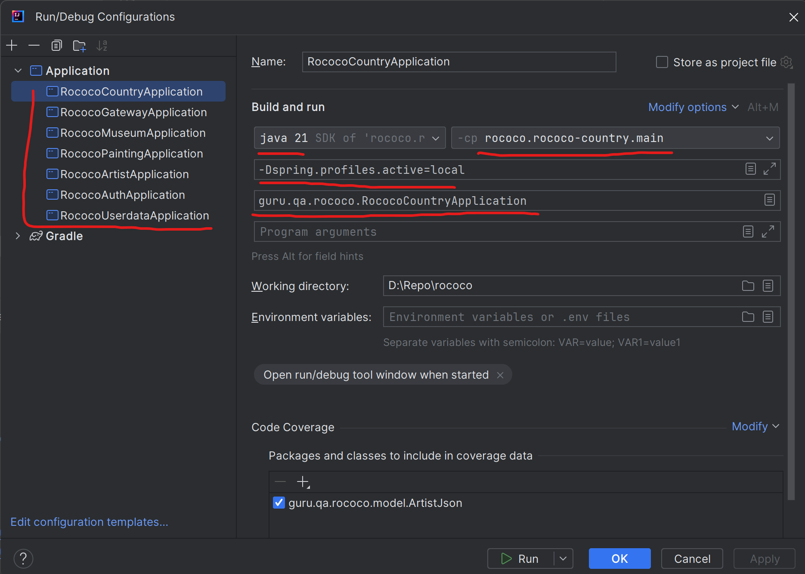

<br>


# 🎨 Rococo

#### 🚀 Rococo — это веб-приложение, предназначенное для управления картинами, их авторами и музеями. Проект предоставляет удобный интерфейс для каталогизации художественных произведений, а также инструмент для администрирования данных об известных художниках и их работах.
С помощью Rococo можно:
 - Добавлять, редактировать и удалять картины.
 - Управлять информацией об авторах, связывая их с произведениями искусства.
 - Организовывать данные о музеях и выставках.

Использовать удобный поиск и фильтрацию для быстрого доступа к нужным данным.

Проект создан с целью упрощения управления коллекциями картин и будет полезен как для профессионалов, так и для любителей искусства.

## Оглавление
 
 - [Используемые технологии](#techology)
 - [Архитектура приложения](#architecture)
 - [Список портов приложения](#application-ports)
 - [Запуск приложения локально в IDE](#local-boot)
 - [Запуск приложения в Docker](#docker-boot)
 - [Запуск тестов локально](#local-test-run)
 - [Запуск тестов в Docker](#docker-test-run)
 - [Пример отчета Allure](#allure-report-example)

<a name="techology"></a>
## Используемые технологии

- [Spring Authorization Server](https://spring.io/projects/spring-authorization-server)
- [Spring OAuth 2.0 Resource Server](https://docs.spring.io/spring-security/reference/servlet/oauth2/resource-server/index.html)
- [Spring data JPA](https://spring.io/projects/spring-data-jpa)
- [Spring Web](https://docs.spring.io/spring-framework/docs/current/reference/html/web.html#spring-web)
- [Spring GRPC](https://docs.spring.io/spring-grpc/reference/index.html)
- [Spring actuator](https://docs.spring.io/spring-boot/docs/current/reference/html/actuator.html)
- [Spring web-services](https://docs.spring.io/spring-ws/docs/current/reference/html/)
- [Apache Kafka](https://developer.confluent.io/quickstart/kafka-docker/)
- [Docker](https://www.docker.com/resources/what-container/)
- [Docker-compose](https://docs.docker.com/compose/)
- [MySQL](https://www.mysql.com/about/)
- [Svelte](https://ru.reactjs.org/docs/getting-started.html)
- [Jakarta Bean Validation](https://beanvalidation.org/)
- [Jakarta JAXB](https://eclipse-ee4j.github.io/jaxb-ri/)
- [JUnit 5 (Extensions, Resolvers, etc)](https://junit.org/junit5/docs/current/user-guide/)
- [Retrofit 2](https://square.github.io/retrofit/)
- [Allure](https://docs.qameta.io/allure/)
- [Selenide](https://selenide.org/)
- [Selenoid & Selenoid-UI](https://aerokube.com/selenoid/latest/)
- [Allure-docker-service](https://github.com/fescobar/allure-docker-service)
- [Java 21](https://adoptium.net/en-GB/temurin/releases/)
- [GHA](https://docs.github.com/en/actions)
- И многие другие

<a name="architecture"></a>
## Архитектура приложения

Приложение Rococo реализовано с использованием микросервисной архитектуры, где каждый сервис выполняет свою уникальную роль:

- **auth** — отвечает за процесс аутентификации и авторизации пользователей.
- **gateway** — является центральной точкой для обработки клиентских запросов и маршрутизации их к нужным микросервисам.
- **userdata** — хранит информацию о пользователях, такую как юзернейм, имя, фамилия и аватар.
- **country**  — предоставляет данные о странах.
- **museum** — управляет сведениями о музеях.
- **artist** — хранит данные о художниках.
- **painting** — содержит информацию о картинах.
- **frontend** — представляет собой пользовательский интерфейс, с которым взаимодействуют конечные пользователи.
- **kafka-log** - выполняет роль Consumer'а, обрабатывает сообщения от сервисов и сохраняет в отдельную базу события по добавлению или изменению сущностей

Все запросы пользователей направляются через auth и gateway, которые обрабатывают их через REST API. Прочие микросервисы скрыты от прямого взаимодействия с пользователем.

Микросервисы общаются между собой через GRPC, при этом gateway передает данные авторизации из auth-сервиса и не раскрывает информацию о пользователях другим сервисам, обеспечивая таким образом безопасность и разделение ответственности.

Таким образом, архитектура приложения позволяет легко масштабировать и поддерживать систему, разделяя данные и процессы по отдельным сервисам, каждый из которых фокусируется на своей задаче.


<a name="application-ports"></a>
## Список портов приложения

|  Сервис   |     Порт      |
|:---------:|:-------------:|
|   AUTH    | 9000 (server) |
|  GATEWAY  | 8080 (server) |
|  ARTIST   |  8091 (grpc)  |
|  MUSEUM   |  8093 (grpc)  |
| PAINTING  |  8094 (grpc)  |
|  COUNTRY  |  8092 (grpc)  |
| USERDATA  |  8089 (grpc)  |
| FRONTEND  |  80 (server)  |
| KAFKA-LOG | 8095 (server) |

<a name="local-boot"></a>
## Запуск приложения локально в IDE
### 1. Условия для локального запуска:
- Если у вас Windows, то рекомендуется использовать bash терминал, например [Git Bash](https://gitforwindows.org/)
- Установленная Java 21
- Установлен пакетный менеджер npm <br>
[Installation](https://docs.npmjs.com/downloading-and-installing-node-js-and-npm)
- Установлен докер <br>
[Installation](https://docs.docker.com/engine/install/)
- Спуллить нужные имейджи
```posh
$ docker pull mysql:8.0
$ docker pull confluentinc/cp-kafka:7.3.2
$ docker pull confluentinc/cp-zookeeper:7.3.2
```
- Создать volume для сохранения данных из БД в docker на вашем компьютере
```posh
$ docker volume create mysql-data
```
### 2. Запуск докер-контейнеров для запуска сервисов и старат тестов
Выполнить скрипт localenv.sh в корне проекта
 ```posh
$ bash localenv.sh
```
или выполнить поочередно команды
```posh
$ docker run --name rococo-db -p 3306:3306 -e MYSQL_ROOT_PASSWORD=secret -v mysql-data:/var/lib/mysql -d mysql:8.0
$ docker run --name=zookeeper -e ZOOKEEPER_CLIENT_PORT=2181 -p 2181:2181 -d confluentinc/cp-zookeeper:7.3.2
$ docker docker run --name=kafka -e KAFKA_BROKER_ID=1 \
    -e KAFKA_ZOOKEEPER_CONNECT=$(docker inspect zookeeper --format='{{ .NetworkSettings.IPAddress }}'):2181 \
    -e KAFKA_ADVERTISED_LISTENERS=PLAINTEXT://localhost:9092 \
    -e KAFKA_OFFSETS_TOPIC_REPLICATION_FACTOR=1 \
    -e KAFKA_TRANSACTION_STATE_LOG_MIN_ISR=1 \
    -e KAFKA_TRANSACTION_STATE_LOG_REPLICATION_FACTOR=1 \
    -p 9092:9092 -d confluentinc/cp-kafka:7.3.2

cd rococo-client
npm i
npm run dev
```
Сразу после стартует frontend на порту 3000, доступен по http://127.0.0.1:3000/

### 2. Прописать в Run конфигурации профиль local
Для этого зайти в меню Run -> Edit Configurations -> выбрать main класс -> добавить VM options -Dspring.profiles.active=local. И так для каждого сервиса


Либо перейти к main-классу каждого приложения -> кликнуть по методу ПКМ -> выбрать More Run/Debug -> Modify Run Configuration -> добавить VM options -Dspring.profiles.active=local.

### 3. Запустить все сервисы
Первым нужно запустить `Auth` и `Gateway`, а уже после можно запустить все остальные - `Artist`, `Country`, `Museum`, `Userdata`, `Painting`, `kafka-log`

Запустить можно командой Run в IDE

<a name="docker-boot"></a>
## Запуск приложения в Docker
#### 1. Создать бесплатную учетную запись на https://hub.docker.com/ (если отсутствует)
#### 2. Создать в настройках своей учетной записи access_token [Инструкция](https://docs.docker.com/docker-hub/access-tokens/).
#### 3. Выполнить docker login с созданным access_token (в инструкции это описано)
#### 4. Прописать в etc/hosts элиас для Docker-имени

        frontend:  127.0.0.1 frontend.rococo.dc,
        auth:      127.0.0.1 auth.rococo.dc
        gateway:   127.0.0.1 gateway.rococo.dc

Для *nix:
```posh
$ vi /etc/hosts
```
```posh
127.0.0.1       localhost
127.0.0.1       frontend.rococo.dc
127.0.0.1       auth.rococo.dc
127.0.0.1       gateway.rococo.dc
```
В windows файл hosts лежит по пути:
```
C:\Windows\System32\drivers\etc\hosts
```

#### 5. Перейти в корневой каталог проекта и запустить все сервисы

```posh
$ bash docker-compose-dev.sh
```
Текущая версия docker-compose-dev.sh удалит все старые Docker контейнеры в системе, поэтому если у Вас есть созданные
контейнеры для других проектов - отредактируйте строку ```posh docker rm $(docker ps -a -q)```, чтобы включить в grep
только те контейнеры, которые относятся к rococo.

Rococo при запуске в докере будет работать для Вас по адресу http://frontend.rococo.dc

<a name="local-test-run"></a>
## Запуск тестов локально

**Обратите внимание! Запуск тестов происходит в три потока. Изменить число потоков можно в
файле [junit-platform.properties](rococo-tests%2Fsrc%2Ftest%2Fresources%2Fjunit-platform.properties)**

1. Запустить приложение локально и запустить тесты из корня проекта
```posh
$ ./gradlew :rococo-tests:clean test
```

2. После прогона тестов запустить формирование отчёта командой:
```posh
$ ./gradlew :rococo-tests:allureServe
```

<a name="docker-test-run"></a>
## Запуск тестов в докере

1. Добавить в файл hosts строки (как работать с файлом hosts описано в пункте [Прописать в etc/hosts элиас для Docker-имени](#hosts)):

<b>127.0.0.1 allure</b>
<b>127.0.0.1 selenoid</b>

Итоговый файл hosts должен выглядеть следующим образом:

```posh
127.0.0.1       localhost
127.0.0.1       frontend.rococo.dc
127.0.0.1       auth.rococo.dc
127.0.0.1       gateway.rococo.dc
127.0.0.1       allure
127.0.0.1       selenoid
```

1. Запустить скрипт:
```posh
$ bash docker-compose-tests.sh
```

2. После того, как все контейнеры успешно соберутся и запустятся - переключиться на логи контейнера rococo-tests командой:
```posh
$ docker logs -f rococo-tests
```

3. Дополнительные варианты запуска
   
Можно выбрать браузер, передав его название (chrome или firefox) в параметрах команды (главное писать название браузера большими буквами):
```posh
bash docker-compose-test.sh CHROME
bash docker-compose-test.sh FIREFOX
```
По умолчанию, если не передавать в команде название браузера, используется CHROME.

Если передать флаг tests-only то рестартанут (удалятся и установятся с нуля) только тестовые контейнеры (rococo-tests, allure, allure-ui, selenoid, selenoid-ui)

```posh
bash docker-compose-tests.sh --tests-only
bash docker-compose-tests.sh FIREFOX --tests-only - тесты запустятся на браузере firefox 
```

Если передать флаг rococo-tests-only то рестартанут (удалятся и установятся с нуля) только контейнер с тестами (rococo-tests). Пригодится если хочется хранить историю запуска тестов в аллюре
```posh
bash docker-compose-tests.sh --rococo-tests-only
bash docker-compose-tests.sh FIREFOX --rococo-tests-only - тесты запустятся на браузере firefox
```
<a name="allure-report-example"></a>
## Пример отчета Allure

В результате можно видеть красивый отчет Allure по [ссылке](http://allure:5252/allure-docker-service-ui/project/romketa-rococo)


