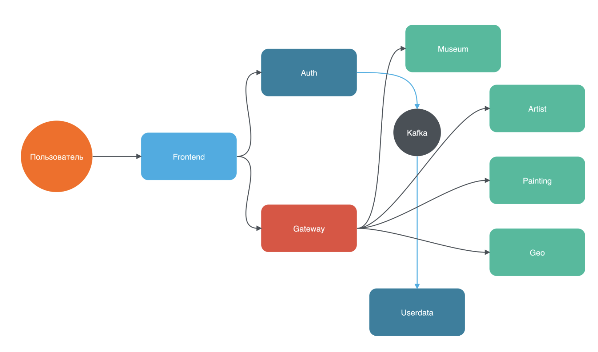

# 🎨 Rococo

#### 🚀 Rococo — это веб-приложение, предназначенное для управления картинами, их авторами и музеями. Проект предоставляет удобный интерфейс для каталогизации художественных произведений, а также инструмент для администрирования данных об известных художниках и их работах.
С помощью Rococo можно:
 - Добавлять, редактировать и удалять картины.
 - Управлять информацией об авторах, связывая их с произведениями искусства.
 - Организовывать данные о музеях и выставках.

Использовать удобный поиск и фильтрацию для быстрого доступа к нужным данным.

Проект создан с целью упрощения управления коллекциями картин и будет полезен как для профессионалов, так и для любителей искусства.

## Оглавление
 
 - [Используемые технологии] (#techology)
 - [Архитектура приложения] (#architecture)
 - [Список портов приложения] (#application-ports)
 - [Запуск приложения локально в IDE] (#local-boot)
 - [Запуск приложения в Docker] (#docker-boot)
 - [Запуск тестов локально] (#local-test-run)
 - [Запуск тестов в Docker] (#docker-test-run)
 - [Пример отчета Allure] (#allure-report-example)

<a name="techology"></a>
## Используемые технологии

- [Spring Authorization Server](https://spring.io/projects/spring-authorization-server)
- [Spring OAuth 2.0 Resource Server](https://docs.spring.io/spring-security/reference/servlet/oauth2/resource-server/index.html)
- [Spring data JPA](https://spring.io/projects/spring-data-jpa)
- [Spring Web](https://docs.spring.io/spring-framework/docs/current/reference/html/web.html#spring-web)
- [Spring GRPC](https://docs.spring.io/spring-grpc/reference/index.html)
- [Spring actuator](https://docs.spring.io/spring-boot/docs/current/reference/html/actuator.html)
- [Spring web-services](https://docs.spring.io/spring-ws/docs/current/reference/html/)
- [Apache Kafka](https://developer.confluent.io/quickstart/kafka-docker/)
- [Docker](https://www.docker.com/resources/what-container/)
- [Docker-compose](https://docs.docker.com/compose/)
- [MySQL](https://www.mysql.com/about/)
- [Svelte](https://ru.reactjs.org/docs/getting-started.html)
- [Jakarta Bean Validation](https://beanvalidation.org/)
- [Jakarta JAXB](https://eclipse-ee4j.github.io/jaxb-ri/)
- [JUnit 5 (Extensions, Resolvers, etc)](https://junit.org/junit5/docs/current/user-guide/)
- [Retrofit 2](https://square.github.io/retrofit/)
- [Allure](https://docs.qameta.io/allure/)
- [Selenide](https://selenide.org/)
- [Selenoid & Selenoid-UI](https://aerokube.com/selenoid/latest/)
- [Allure-docker-service](https://github.com/fescobar/allure-docker-service)
- [Java 21](https://adoptium.net/en-GB/temurin/releases/)
- [GHA](https://docs.github.com/en/actions)
- И многие другие

<a name="architecture"></a>
## Архитектура приложения

Приложение Rococo реализовано с использованием микросервисной архитектуры, где каждый сервис выполняет свою уникальную роль:

- **auth** — отвечает за процесс аутентификации и авторизации пользователей.
- **gateway** — является центральной точкой для обработки клиентских запросов и маршрутизации их к нужным микросервисам.
- **userdata** — хранит информацию о пользователях, такую как юзернейм, имя, фамилия и аватар.
- **country**  — предоставляет данные о странах.
- **museum** — управляет сведениями о музеях.
- **artist** — хранит данные о художниках.
- **painting** — содержит информацию о картинах.
- **frontend** — представляет собой пользовательский интерфейс, с которым взаимодействуют конечные пользователи.
- **kafka-log** - выполняет роль Consumer'а, обрабатывает сообщения от сервисов и сохраняет в отдельную базу события по добавлению или изменению сущностей

Все запросы пользователей направляются через auth и gateway, которые обрабатывают их через REST API. Прочие микросервисы скрыты от прямого взаимодействия с пользователем.

Микросервисы общаются между собой через GRPC, при этом gateway передает данные авторизации из auth-сервиса и не раскрывает информацию о пользователях другим сервисам, обеспечивая таким образом безопасность и разделение ответственности.

Таким образом, архитектура приложения позволяет легко масштабировать и поддерживать систему, разделяя данные и процессы по отдельным сервисам, каждый из которых фокусируется на своей задаче.

<a name="application-ports"></a>
## Список портов приложения

|  Сервис   |     Порт      |
|:---------:|:-------------:|
|   AUTH    | 9000 (server) |
|  GATEWAY  | 8080 (server) |
|  ARTIST   |  8091 (grpc)  |
|  MUSEUM   |  8093 (grpc)  |
| PAINTING  |  8094 (grpc)  |
|  COUNTRY  |  8092 (grpc)  |
| USERDATA  |  8089 (grpc)  |
| FRONTEND  |  80 (server)  |
| KAFKA-LOG | 8095 (server) |

<a name="local-boot"></a>
## Запуск приложения локально в IDE
- Если у вас Windows, то рекомендуется использовать bash терминал
- Установленная Java 21
- Установлен пакетный менеджер npm <br>
[Installation](https://docs.npmjs.com/downloading-and-installing-node-js-and-npm)
- Установлен докер <br>
[Installation](https://docs.docker.com/engine/install/)
- Спуллить нужные имейджи
```bash
docker pull mysql:8.0
docker pull confluentinc/cp-kafka:7.3.2
docker pull confluentinc/cp-zookeeper:7.3.2
```
- Создать volume для сохранения данных из БД в docker на вашем компьютере
```bash
docker volume create mysql-data
```
<a name="docker-boot"></a>
## Запуск приложения в Docker

<a name="local-test-run"></a>
## Запуск тестов локально

<a name="docker-test-run"></a>
## Запуск тестов в докере

<a name="allure-report-example"></a>
## Пример отчета Allure

```bash
asd
```

Локальный запуск команды


на linux/mac
```bash
./gradlew :rococo-tests:clean test
./gradlew :rococo-tests:allureServe
```

на винде
```bash
gradlew.bat :rococo-tests:clean test
gradlew.bat :rococo-tests:allureServe
```
 
должен быть установлена БД - docker run --name rococo -p 3306:3306 -e MYSQL_ROOT_USER: root -e MYSQL_ROOT_PASSWORD=secret -d mysql:8.0

  Приветствую тебя, мой дорогой студент!
Если ты это читаешь - то ты собираешься сделать первый шаг в написании диплома QA.GURU Advanced.

  Это один из двух вариантов дипломной работы - второй расположен [тут, называется Rangiffler](https://github.com/qa-guru/rangiffler)
Проекты отличаются как по своей механике, так и технологиям (Rococo использует классический REST на frontend, 
тогда как Rangiffler использует GraphQL). Следует сказать, что Rangiffler может отказаться немного сложнее именно из-за GraphQL.
Выбор за тобой!

  Далее я опишу основные направления работы, но помни, что этот диплом - не шаблонная работа, а место
для творчества - прояви себя!

  Кстати, Rococo - стиль в искусстве (живописи и не только), а значит дело пахнет микросервисами, 
отвечающими за художников, их картины и музеи. И тестами на все это, которые должны стать искусством.

# Что будет являться готовым дипломом?

  Тут все просто, диплом глобально требует от тебя реализовать три вещи:

- Реализовать бэкенд на микросервисах (Spring boot, но если вдруг есть желание использовать что-то другое - мы не против)
- Реализовать полноценное покрытие тестами микросервисов и frontend (если будут какие-то
  unit-тесты - это большой плюс!)
- Красиво оформить репозиторий на гихабе, что бы любой, кто зайдет на твою страничку, смог понять,
  как все запустить, как прогнать тесты. Удели внимание этому пункту. Если я не смогу все запустить по твоему README - диплом останется без проверки

# С чего начать?

  Мы подготовили для тебя полностью рабочий frontend, а так же страницы регистрации и логина для сервиса auth.
Кроме того, у тебя есть и набор моков для [Wiremock](https://wiremock.org/docs/standalone/docker/) - благодаря этому, даже не приступая к написанию кода, ты сможешь посмотреть механику проекта Rococo. 
В этом наборе моков есть все запросы, которые тебе в конце концов, придется реализовать в своем бэкенде.
Важно понимать, что несмотря на наличие моков mutation запросов (например, удаление картины), никакого реального удаления не произойдет, и при обновлении страницы
Wiremock отдаст тот же набор данных, что и до удаления.

  И самое главное - у тебя есть проект niffler, который будет выступать образцом для подражания в разработке микросервисов.
Тестовое покрытие niffler, которого мы с тобой добились на настоящий момент, однако, является достаточно слабым - учтите это при написании тестов на Rococo - это,
все-таки, диплом для SDET / Senior QA Automation и падать в грязь лицом с десятком тестов на весь сервис
точно не стоит. Итак, приступим!

#### 1. Обнови зависимости и запускай фронт Rococо:

```posh
Dmitriis-MacBook-Pro rococo % cd rococo-client
Dmitriis-MacBook-Pro rococo-client % npm i
Dmitriis-MacBook-Pro rococo-client % npm run dev
```

  Фронт стартанет в твоем браузере на порту 3000: http://127.0.0.1:3000/
Обрати внимание! Надо использовать именно 127.0.0.1, а не localhost, но даже если ты по ошибке перейдешь на localhost, 
front автоматически тебя перенаправит.

#### 2. Запустите Wiremock, он заменит собо потенциальный сервис rococo-gateway, который только предстоит написать

```posh
docker pull wiremock/wiremock:2.35.0
docker run --name rococo-mock -p 8080:8080 -v ./wiremock/rest:/home/wiremock -d wiremock/wiremock:2.35.0 --global-response-templating --enable-stub-cors
```
  Эти команды надо запускать в корне проекта, там же есть скрипт `wiremock.sh`, делающий ровно то же самое. Можно просто запустить его.

  Wiremock стартанет на порту 8080: http://127.0.0.1:8080/ и будет готов отдавать тебе статические ответы на все запросы, уходящие
с фронта rococo. Кнопка "Войти" пока что не работает, что логично, ведь у нас нет сервиса auth.
Однако, наш Wiremock понимает некоторые запросы с oauth token, при чем ему не важно - какой именно это токен.
Поэтому, что бы смоделировать ситуация "я залогинился", то просто зайди в dev tools браузера,
перейди в Application, там - в LocalStorage и добавь туда токен:
- ключ id_token
- значение - любая строка, например "faketoken"

  После этого обнови страницу фронта и убедись, что вместо кнопки "Войти" у тебя отобразился профиль, а POST запросы заработали.

# Что дальше?

#### 1. В первую очередь, необходимо подумать над сервисами - какие тебе понадобятся.

  Например, можно предложить вот такую структуру сервисов:



  ВАЖНО! Картинка - не догма, а лишь один из вариантов для примера.
Взаимодействие между gateway и всеми остальными сервисами можно сделать с помощью 
REST, gRPC или SOAP. Я бы посоветовал отдать предпочтение gRPC.

#### 2. Далее, необходимо реализовать сервис rococo-auth

  Фронтенд полностью готов к использованию сервиса auth на порту 9000,
твоя задача взять сервис niffler-auth и аккуратно переделать его для работы с rococo.
Страницы логина / регистрации, а так же стили и графику мы даем:

- eye.svg
- eye-active.svg
- hermitage.jpeg
- renuar.jpeg
- favicon.ico
- styles.css
- login.html
- register.html

  Основная задача - аккуратно заменить упоминания о niffler в этом сервисе, а в идеале - еще и
разобраться, как он работает. В этом будет полезно видео:
[Implementing an OAuth 2 authorization server with Spring Security - the new way! by Laurentiu Spilca](https://youtu.be/DaUGKnA7aro)
[Full Stack OAuth 2 - With Spring Security / React / Angular Part 1](https://youtu.be/SfNIjS_2H4M)
[Full Stack OAuth 2 - With Spring Security / React / Angular Part 2](https://youtu.be/3bGer6-6mdY)

#### 3. Как только у вас появилось уже 2 сервиса, есть смысл подумать о докеризации

  Чем раньше у ваc получится запустить в докере фронт и все бэкенды, тем проще будет дальше.
На самом деле, докеризация не является строго обязательным требованием, но если вы хотите в будущем
задеплоить свой сервис на прод, прикрутить CI/CD, без этого никак не обойдется.

  Я советую использовать плагин jib - как в niffler, для бэкендов, и самописный dockerfile для фронта.
Фронтенд использует фреймворк Svelte, но докеризация там работает ровно так же, как и для React в Niffler.

#### 4. Выбрать протокол взаимодействия между сервисами

  В поставляемом фронтенде классический REST. А вот взаимодействие между микросервисами можно
делать как угодно! REST, gRPC, SOAP. Делай проект я, однозначно взял бы gRPC - не писать руками кучу
model-классов, получить перформанс и простое написание тестов. Стоит сказать, что здесь не
понадобятся streaming rpc, и все ограничится простыми унарными запросами. Однако если вы хотите
использовать REST или SOAP - мы не будем возражать.

#### 5. Реализовать микросервисный backend

  Это место где, внезапно, СОВА НАРИСОВАНА! :)
На самом деле, концептуально и технически каждый сервис будет похож на что-то из niffler, поэтому
главное внимательность и аккуратность. Любые отхождения от niffler возможны - ты можешь захотеть
использовать, например, NoSQL базы или по другому организовать конфигурацию / структуру проекта -
никаких ограничений, лишь бы сервис выполнял свое прямое назначение

##### Особенности реализации backend

###### Сервис gateway, работа с пагинацией

   В отличие от Niffler, проект Rococo использует пагинацию (что бы грузить данные с бэка по частям), а это значит что в `rococo-gateway` должны быть реализованы 
Pageble контроллеры.
Пример:
```java
  @GetMapping()
  public Page<ArtistJson> getAll(@RequestParam(required = false) String name,
                                 @PageableDefault Pageable pageable) {
    return artistService.getAll(name, pageable);
  }
```
  Здесь объект `Pageable` - приходит в виде GET параметров с фронта. Спринг сам превратит GET параметры в этот объект.
Так же GET парметром может прийти (а может и нет) параметр name. Тогда запрос в БД должен включать фильтрацию по полю name (`ContainsIgnoreCase`)
Пример репозитория с запросом к БД с учетом Pageable и name (он будет, размеется, не в `rococo-gateway`, а в конечных микросервисах)
```java
public interface ArtistRepository extends JpaRepository<ArtistEntity, UUID> {

  @Nonnull
  Page<ArtistEntity> findAllByNameContainsIgnoreCase(
          @Nonnull String name,
          @Nonnull Pageable pageable
  );
}
```
  Тип `Page<T>` - это ровно то, что ожидает от вас получит фронт, вам лишь придется преобразовать его в Page<ArtistJson>, 
для этого надо воспользоваться методом `map()`, имеющимся в классе Page.

Почитать про пагинацию, дополнительно, тут: https://www.baeldung.com/spring-data-jpa-pagination-sorting

###### Передача `Pageable` по gRPC между сервисами, возврат `Page` из сервисов

  Тут все просто. Когда вас с фронта приходит `@PageableDefault Pageable pageable` - из него можно достать две цифры -
`page` и `size`. + не забыть про третий опциональный парметр - `name`. Тогда, к примеру, gRPC сообщение в сервис с художнниками 
могло бы выглядеть так:
```protobuf
message ArtistsRequest {
  string name = 1;
  int32 page = 2;
  int32 size = 3;
}

message ArtistsResponse {
  repeated Artist artists = 1;
  int32 total_count = 2;
}
```
  Тогда мы сможем вернуть на фронт созданный руками Pageable
```java
            List<ArtistJson> artistJsonList = response.getArtistsList()
                    .stream()
                    .map(ArtistJson::fromGrpcMessage)
                    .toList();
            return new PageImpl<>(artistJsonList, pageable, response.getTotalCount());
```

  Здесь объект `pageable` - это тот, что мы изначально получили от фронта для выполнения запроса, а `response.getTotalCount()`
- общее число художников в базе.

###### Security config

   Необходим доступ без авторизации к эндпойнту `/api/session` и к GET запросам без необходимости быть
аторизованным, для этого пропишем их в security config сервиса `rococo-gateway`:
```java
    @Bean
    public SecurityFilterChain securityFilterChain(HttpSecurity http) throws Exception {
        corsCustomizer.corsCustomizer(http);

        http.authorizeHttpRequests(customizer ->
                customizer.requestMatchers(
                                antMatcher(HttpMethod.GET, "/api/session"),
                                antMatcher(HttpMethod.GET, "/api/artist/**"),
                                antMatcher(HttpMethod.GET, "/api/museum/**"),
                                antMatcher(HttpMethod.GET, "/api/painting/**"))
                        .permitAll()
                        .anyRequest()
                        .authenticated()
        ).oauth2ResourceServer((oauth2) -> oauth2.jwt(Customizer.withDefaults()));
        return http.build();
    }
```
Все прочие эндпойнты должны требовать авторизацию

   В связи с тем, что проект подразумевает GET запросы без авторизации, то и тесты должны учитывать разные кейсы, 
авторизованный пользователь и нет

#### 6. Подготовить структуру тестового "фреймворка", подумать о том какие прекондишены и как вы будете создавать

  Здесь однозначно понадобится возможность API-логина и работы со всеми возможными preconditions проекта - картинами,
художниками, музеями. Например, было бы хорошо иметь тесты примерно такого вида:
```java
@Test
@DisplayName("...")
@Tag("...")
@ApiLogin(user = @TestUser)
@TestMuseum(title = "Музей в Китай", country = "Китай", city = "Пекин")
void exampleTest(MuseumJson createdMuseum) { ... }

@Test
@DisplayName("...")
@TestPainting
@TestMuseum
@TestArtist
@Tag("...")
void exampleTest2(PaintingJson createdPainting, MuseumJson createdMuseum, ArtistJson createdArtist) { ... }
```

#### 7. Реализовать достаточное, на твой взгляд, покрытие e-2-e тестами

  На наш взгляд, только основны позитивных сценариев тут не менее трех десятков.
А если не забыть про API-тесты (будь то REST или gRPC), то наберется еще столько же.

#### 8. Оформить все красиво!

  Да, тут еще раз намекну про важность ридми, важность нарисовать топологию (схему) твоих сервисов, важность скриншотиков и прочих красот.
Очень важно думать о том, что если чего-то не будет описано в README, то и проверить я это что-то не смогу.


